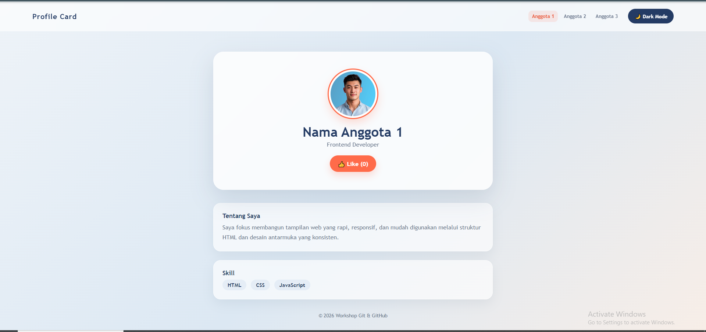

# Overview

"Apa itu Git" adalah halaman kartu profil interaktif dengan fitur dark mode dan like counter, dibuat sebagai bahan study case Workshop Git & GitHub.

---

## Visualisasi




---

## Tech Stack

- HTML5
- CSS3
- JavaScript (Vanilla)
- Git & GitHub

---

## Fitur Utama

- [ ] Toggle Dark Mode
- [ ] Like Counter interaktif
- [ ] Responsive layout
- [ ] 

---


## Contribution

| Nama Anggota | Role | Kontribusi |
|---|---|---|
| VeronicA-bin | Project Initiator | Membuat repository, mengatur akses kolaborator, commit `index.html` |
| ReiTomoko | Styling Engineer | Membuat branch `styling`, menambahkan & menghubungkan `style.css` |
| VeronicARei | Script Engineer | Membuat branch `scripting`, menambahkan & menghubungkan `script.js` |

---

## How to Run

1. Clone repository ini:
   ```bash
  
   ```
2. Buka folder hasil clone, lalu klik dua kali file `index.html` (atau klik kanan → Open with → Browser).
